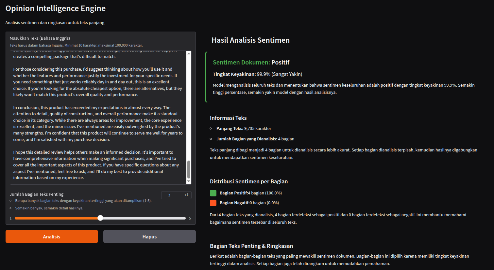

# Opinion Intelligence Engine

Proyek pembelajaran untuk menganalisis opini dan pendapat dari teks panjang menggunakan machine learning. Sistem ini dapat memahami sentimen (positif/negatif) dan merangkum inti dari opini yang dianalisis.




## Problem Statement

Dalam dunia digital, opini dan pendapat pengguna tersebar dalam berbagai bentuk teks panjang seperti review produk, komentar di media sosial, feedback pelanggan, dan artikel opini. Untuk memahami sentimen dan inti dari opini tersebut, diperlukan analisis yang dapat menangani teks panjang secara menyeluruh.

Model machine learning untuk analisis sentimen seringkali memiliki keterbatasan dalam memproses teks panjang karena batasan input length (maksimal 512 token). Proyek ini mencoba mengatasi masalah tersebut dengan memecah teks panjang menjadi bagian-bagian kecil, menganalisis setiap bagian, dan menggabungkan hasilnya untuk mendapatkan sentimen keseluruhan.


## Features

- Analisis sentimen teks panjang (positif atau negatif)
- Menentukan tingkat keyakinan dari analisis
- Memilih bagian teks penting yang paling mewakili sentimen
- Merangkum bagian teks penting menjadi ringkasan singkat


## Limitations

- Hanya mendukung bahasa Inggris karena keterbatasan dataset bahasa Indonesia yang sesuai dengan tujuan proyek
- Tidak bisa menganalisis teks yang sangat pendek (< 10 karakter)
- Tidak 100% akurat (seperti semua model ML)
- Tidak bisa memahami sarkasme atau konteks sangat kompleks
- Hanya untuk teks, tidak untuk gambar/audio/video
- Processing membutuhkan waktu beberapa menit karena keterbatasan komputasi CPU pada deployment **demo**.

## Models Lifecycle

Model ML bisa mencapai ratusan MB hingga GB, tidak efisien di-commit ke Git

**Alur:**
1. Model dilatih di Google Colab dan disimpan ke Google Drive
2. Script `download_models.py` mengunduh model dari Google Drive ke folder `models/`
3. Script otomatis dijalankan saat Docker build, atau manual: `python download_models.py`

**Persiapan:**
- Google Drive folder harus di-share dengan akses "Anyone with the link"
- Set folder IDs di `.env`: `SENTIMENT_FOLDER_ID` dan `SUMMARIZATION_FOLDER_ID`

## Quick Start

### Docker (Recommended)

```bash
# 1. Copy .env.example menjadi .env
cp .env.example .env

# 2. Edit .env dan isi SENTIMENT_FOLDER_ID dan SUMMARIZATION_FOLDER_ID
#    dengan Google Drive folder IDs

# 3. Build dan jalankan
docker-compose up -d --build

# 4. Tunggu build selesai (~35-50 menit pertama kali)
# 5. Buka http://localhost:8000
```

### Manual Setup

```bash
# 1. Buat virtual environment
python3 -m venv venv
source venv/bin/activate  # Linux/Mac
# atau
venv\Scripts\activate     # Windows

# 2. Install dependencies
pip install -r requirements.txt

# 3. Copy .env.example menjadi .env dan isi folder IDs
cp .env.example .env

# 4. Download model dari Google Drive
python download_models.py

# 5. Jalankan server
python api/main.py
```

## Usage

### Web Interface (Gradio)

Buka `http://localhost:8000` di browser.

**Cara Menggunakan:** Masukkan teks panjang dalam bahasa Inggris, atur jumlah bagian teks penting yang ingin ditampilkan (1-5), lalu klik tombol "Analisis". Sistem akan menganalisis sentimen teks dan menampilkan bagian-bagian penting beserta ringkasannya.
 

### API

```bash
curl -X POST "http://localhost:8000/analyze" \
  -H "Content-Type: application/json" \
  -d '{"text": "Your text here...", "max_excerpts": 3}'
```

---

## Notebooks

Notebook-notebook berikut digunakan untuk training dan eksplorasi. Lihat masing-masing notebook untuk detail implementasi:

- **00_setup_environment.ipynb** - Setup environment
https://colab.research.google.com/drive/1zkHFbZlRP5bhreKn7UaXUVnCx5hBFxlk

- **01_data_exploration.ipynb** - Eksplorasi dataset
https://colab.research.google.com/drive/1EX_dc_wepp3JOHmmStU2UmlHeoPLI4xe

- **02_train_sentiment_model.ipynb** - Training model sentiment
https://colab.research.google.com/drive/1UsmSuLXSe8572e4fSvbGyFYPAZeO-xLX

- **03_long_text_sentiment_pipeline.ipynb** - Pipeline untuk teks panjang
https://colab.research.google.com/drive/1VGP1dcVSznavgyoViLgIqjgk1NPkeRM4

- **04_train_summarization_model.ipynb** - Training model summarization
https://colab.research.google.com/drive/1U7myU1zeJ8ZuFVMlaOACl1YvMmlFsiV-

- **05_end_to_end_inference_demo.ipynb** - Demo lengkap
https://colab.research.google.com/drive/122Ok3AcQkTeKx0Vv6WtHKNEwnvWADvv8

## Project Structure

```
opinion-intelligence-engine/
├── notebook/          # Notebook untuk training
├── api/               # Server (FastAPI + Gradio)
├── src/               # Pipeline logic
├── models/            # Trained models (not in GitHub)
├── download_models.py
├── requirements.txt
├── Dockerfile
└── docker-compose.yml
```

## Technologies

- [PyTorch](https://pytorch.org/) - Deep learning framework
- [Transformers](https://huggingface.co/docs/transformers) (HuggingFace) - Pre-trained transformer models
- [FastAPI](https://fastapi.tiangolo.com/) - Modern web framework for building APIs
- [Gradio](https://www.gradio.app/) - Python library for creating ML demos and web apps
- [Docker](https://www.docker.com/) - Containerization platform

**Models:**
- [DistilBERT](https://huggingface.co/docs/transformers/model_doc/distilbert) - Lightweight BERT model untuk sentiment analysis
- [T5-base](https://huggingface.co/docs/transformers/model_doc/t5) - Text-to-Text Transfer Transformer untuk summarization


## Environment Variables

- `PORT`: Port untuk server (default: 8000)
- `ALLOWED_ORIGINS`: CORS allowed origins, pisahkan dengan koma
- `SENTIMENT_FOLDER_ID`: Google Drive folder ID untuk model sentiment
- `SUMMARIZATION_FOLDER_ID`: Google Drive folder ID untuk model summarization

Lihat `.env.example` untuk contoh konfigurasi.


## Notes

- Proyek ini dibuat untuk **catatan pembelajaran NLP**, bukan untuk production
- Model dilatih dengan dataset terbatas
- Kode dibuat sederhana untuk mudah dipahami
